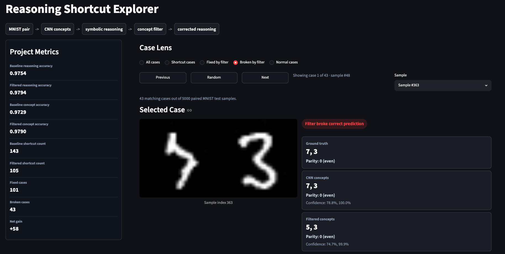

# Analyzing, Explaining, and Reducing Reasoning Shortcuts in Neuro-Symbolic Models

This project studies reasoning shortcuts in a simple neuro-symbolic model using paired MNIST digit images.

A convolutional neural network predicts two digit concepts from a paired image input. A symbolic reasoning rule then computes whether the sum of the two predicted digits is even or odd.

A reasoning shortcut occurs when the final reasoning output is correct, but one or both predicted digit concepts are wrong.

## Dashboard Preview



The project includes an interactive Streamlit dashboard for exploring MNIST image pairs, CNN predictions, filtered predictions, symbolic reasoning outputs, confidence scores, and shortcut status.

Run it with:

```bash
streamlit run dashboard.py
```

## Project Goal

The goal is to analyze, explain, and reduce reasoning shortcuts using a lightweight neural concept-filtering module placed between concept prediction and symbolic reasoning.

The final model uses an uncertainty-weighted residual filter. The CNN is trained first and then frozen. The filter is trained separately to correct uncertain concept predictions before symbolic reasoning.

## Final Results

| Model          | Reasoning Accuracy | Concept Accuracy | Shortcut Count | Shortcut Frequency |
| -------------- | -----------------: | ---------------: | -------------: | -----------------: |
| Baseline CNN   |             0.9754 |           0.9729 |            143 |             0.0286 |
| Filtered Model |             0.9794 |           0.9790 |            105 |             0.0210 |

The uncertainty-weighted residual filter reduced reasoning shortcut cases from **143 to 105**.

## Explainability Analysis

The project explains shortcut behavior at the concept and confidence level.

Main findings:

* Shortcuts often occur through same-parity digit confusions, such as `5 → 3`, `9 → 7`, and `2 → 8`.
* The filter is more effective on uncertain wrong predictions.
* Confident wrong CNN predictions are harder to correct.
* In fixed shortcut cases, the filter increases the probability assigned to the correct digit concepts.

## Project Structure

```text
RS_in_NS_Models/
├── assets/
│   └── dashboard_preview.png
│
├── src/
│   ├── dataset.py
│   ├── models.py
│   ├── reasoning.py
│   ├── utils.py
│   ├── train_cnn.py
│   ├── train_filter.py
│   ├── evaluator.py
│   ├── evaluate.py
│   ├── analyze_shortcuts.py
│   └── visualizer.py
│
├── results/
│   ├── checkpoints/
│   ├── metrics/
│   └── figures/
│
├── dashboard.py
├── requirements.txt
└── README.md
```

## Installation

Create and activate a virtual environment:

```bash
python -m venv .venv
source .venv/bin/activate
```

Install dependencies:

```bash
pip install -r requirements.txt
```

## How to Run

Train and analysis scripts are run from the `src/` directory:

```bash
cd src
```

Train the baseline CNN:

```bash
python train_cnn.py
```

Train the uncertainty-weighted residual filter:

```bash
python train_filter.py
```

Evaluate the baseline and filtered models:

```bash
python evaluate.py
```

Analyze shortcut cases:

```bash
python analyze_shortcuts.py
```

Generate result figures:

```bash
python visualizer.py
```

Run the dashboard from the project root:

```bash
streamlit run dashboard.py
```

## Main Files

### `dataset.py`

Creates paired MNIST samples by placing two digit images side by side.

### `models.py`

Contains the baseline CNN and the residual concept-filtering module.

### `reasoning.py`

Contains symbolic even/odd reasoning utilities.

### `train_cnn.py`

Trains the baseline CNN using concept supervision.

### `train_filter.py`

Freezes the trained CNN and trains the uncertainty-weighted residual filter.

### `evaluate.py`

Evaluates reasoning accuracy, concept accuracy, shortcut count, shortcut frequency, and fixed/broken cases.

### `analyze_shortcuts.py`

Collects shortcut cases and saves concept/confidence-level analysis data.

### `visualizer.py`

Generates final result and explainability figures.

### `dashboard.py`

Provides an interactive Streamlit dashboard for exploring predictions and shortcut behavior.

## References

1. S. Teso, A. Bevilacqua, N. Maculan, and A. Passerini, “RSBench: A Benchmark for Rooting Out Reasoning Shortcuts in Neural-Symbolic Models,” ICML, 2024.
2. K. S. Valmeekam and M. Müller, “Neural-Symbolic ARC: Guiding Symbolic Program Search with Neural Proposals,” 2023.
3. Y. LeCun, L. Bottou, Y. Bengio, and P. Haffner, “Gradient-based learning applied to document recognition,” Proceedings of the IEEE, 1998.